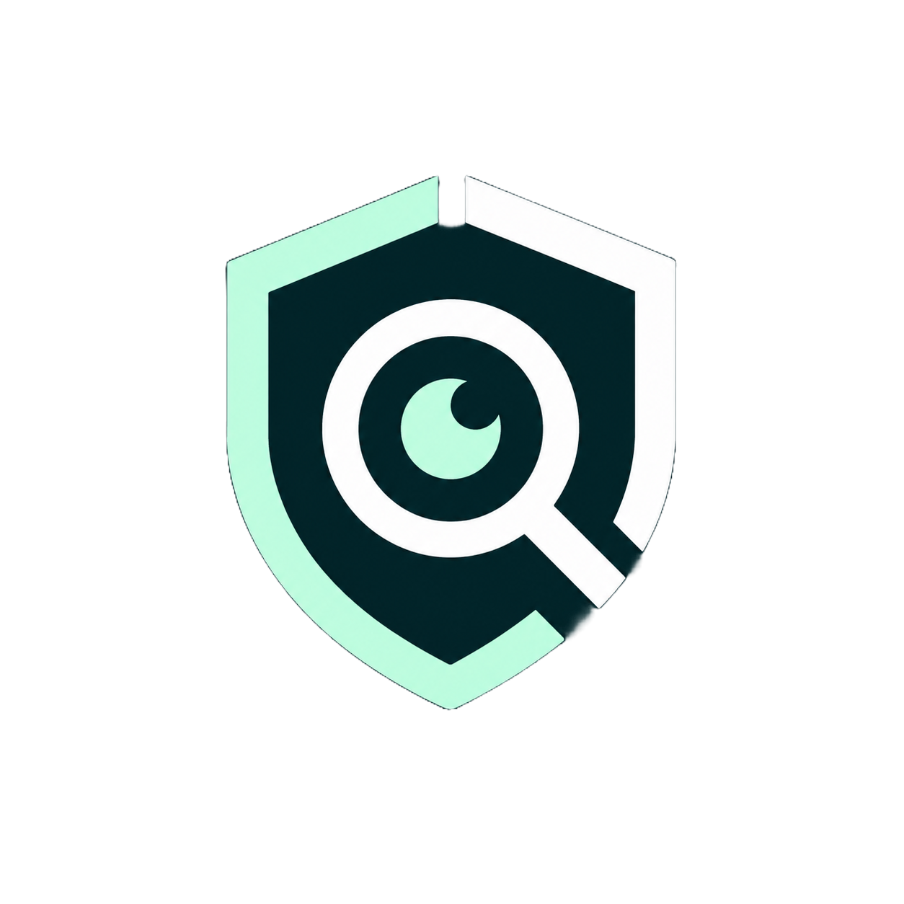
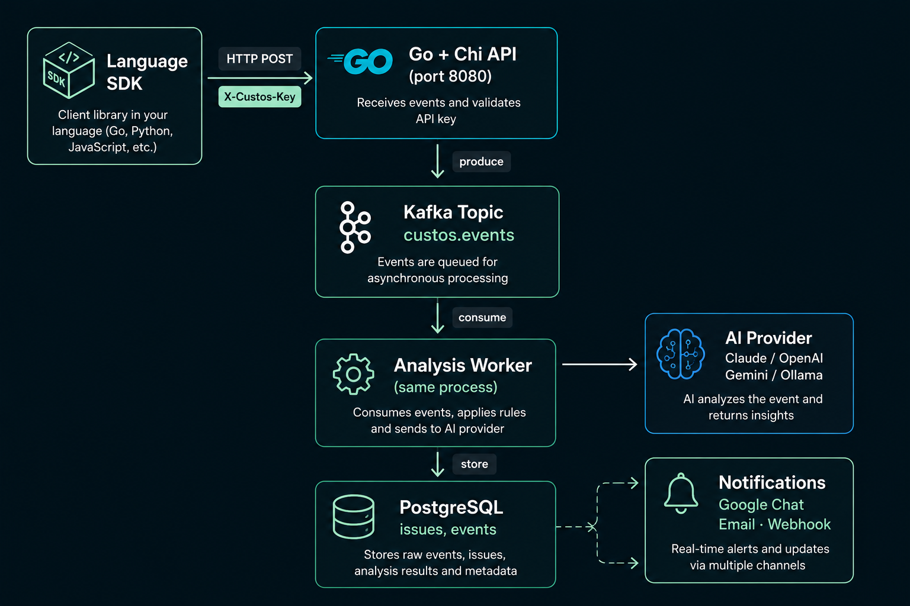

<div align="center">



# Custos

**AI-powered log intelligence for engineering teams.**

Custos captures errors from your applications, runs them through an AI analysis engine, and delivers instant explanations — severity, likely cause, and suggested checks — so your team spends less time digging through stack traces and more time shipping.

[](https://go.dev/doc/go1.26)
[](LICENSE)
[](https://github.com/Godie360/custos/actions/workflows/ci.yml)

</div>

---

## How it works


1. **SDK installed in your app** — drops into your existing logging setup with one line
2. **Events sent to the Custos server** — authenticated per project, over HTTP
3. **AI worker analyzes each error** — explains what went wrong, rates severity, suggests checks
4. **Results stored and surfaced** — via REST API, dashboard, and notifications

---

## Features

- **Language SDKs** — Python (`custos-sdk 0.1.0`), Node.js (`@custos/sdk`), Java coming soon
- **Pluggable AI providers** — Claude, OpenAI, Gemini, or a self-hosted Ollama model
- **Privacy-first** — SDKs strip API keys, passwords, tokens, credit cards, and PII locally before any data leaves your host
- **Async, non-blocking** — background batch queue with exponential backoff retry; never blocks your application
- **Notifications** — Google Chat cards, email, and generic webhooks; Slack coming in Phase 1
- **Full OpenAPI spec** — browse and try every endpoint in the built-in Swagger UI at `localhost:8081`
- **Prometheus metrics** — `/metrics` endpoint ready for scraping
- **Self-hosted** — one `docker compose up` and you own your data

---

## Tech Stack

| Layer | Technology |
|---|---|
| Server | Go 1.26, [Chi](https://github.com/go-chi/chi) |
| Queue | [Apache Kafka](https://kafka.apache.org/) (`segmentio/kafka-go`) |
| Storage | PostgreSQL + [sqlc](https://sqlc.dev/) |
| AI providers | Claude · OpenAI · Gemini · Ollama |
| Python SDK | Pure stdlib — zero runtime dependencies |
| Node.js SDK | TypeScript · Winston · NestJS |
| Dashboard | TanStack Start (Phase 2) |

---

## Quick Start

### 1. Clone

```bash
git clone https://github.com/Godie360/custos.git
cd custos
```

### 2. Configure

```bash
cp .env.example .env
```

Edit `.env` — the only required fields to get AI analysis working:

```env
# Pick one AI provider
CUSTOS_AI_PROVIDER=claude          # claude | openai | gemini | ollama
CUSTOS_AI_API_KEY=sk-ant-...
CUSTOS_AI_MODEL=                   # leave blank to use the provider default

# Optional — notifications
GOOGLE_CHAT_WEBHOOK_URL=https://chat.googleapis.com/v1/spaces/...
WEBHOOK_URL=https://your-webhook.example.com
SMTP_HOST=smtp.example.com
SMTP_PORT=587
SMTP_FROM=alerts@example.com
```

> The server starts without AI analysis if `CUSTOS_AI_PROVIDER` is unset — errors are still captured and stored.

### 3. Start

```bash
docker compose up --build
```

| Service | URL |
|---|---|
| Custos API | http://localhost:8080 |
| Swagger UI | http://localhost:8081 |
| Prometheus metrics | http://localhost:8080/metrics |

### 4. Create a project and generate an API key

```bash
# Create a project
PROJECT=$(curl -s -X POST http://localhost:8080/api/v1/projects \
  -H "Content-Type: application/json" \
  -d '{"name": "my-app"}')
echo $PROJECT | jq .

PROJECT_ID=$(echo $PROJECT | jq -r '.id')

# Generate an API key — shown only once, save it
curl -s -X POST http://localhost:8080/api/v1/projects/$PROJECT_ID/keys \
  -H "Content-Type: application/json" \
  -d '{"name": "production"}' | jq .
```

### 5. Send your first error

```bash
curl -s -X POST http://localhost:8080/api/v1/ingest \
  -H "Content-Type: application/json" \
  -H "X-Custos-Key: custos_..." \
  -d '{
    "service": "payments-api",
    "environment": "production",
    "error_type": "NullPointerException",
    "message": "Cannot read property user of null",
    "stack_trace": [
      "at PaymentService.charge (payment.js:88)",
      "at Router.handle (express.js:284)"
    ]
  }' -w "\nHTTP %{http_code}\n"
```

A `202 Accepted` means the event is queued. Within a few seconds, fetch the issue to see the AI analysis:

```bash
curl -s http://localhost:8080/api/v1/issues | jq '.[0] | {severity, ai_explanation, ai_likely_cause}'
```

---

## SDKs

### Python

```bash
pip install custos-sdk
```

```python
import logging
from custos import CustosHandler

logging.getLogger().addHandler(
    CustosHandler(
        endpoint="http://localhost:8080/api/v1/ingest",
        api_key="custos_...",
        service="payments-api",
        environment="production",
    )
)

# Any logger.error() or logger.exception() call is now captured automatically
try:
    process_payment(order)
except Exception:
    logging.exception("payment failed")
```

Works with **Django**, **Flask**, **FastAPI**, or any framework that uses stdlib logging. See [`sdks/python/README.md`](sdks/python/README.md) for the full reference.

### Node.js / NestJS

```bash
npm install @custos/sdk
```

```ts
// main.ts
import { NestFactory } from '@nestjs/core';
import { CustosClient, CustosExceptionFilter } from '@custos/sdk';

async function bootstrap() {
  const app = await NestFactory.create(AppModule);

  const custos = new CustosClient({
    apiKey: process.env.CUSTOS_API_KEY!,
    host: 'http://localhost:8080',
    service: 'my-nestjs-app',
    environment: process.env.NODE_ENV ?? 'production',
  });

  app.useGlobalFilters(new CustosExceptionFilter(custos));
  await app.listen(3000);
}
bootstrap();
```

Also supports **Winston** and **Pino** transports. See [`sdks/nodejs/README.md`](sdks/nodejs/README.md).

---

## API Reference

Full OpenAPI 3.0 spec: [`api/openapi.yaml`](api/openapi.yaml)

Browse and try every endpoint interactively at **http://localhost:8081** (Swagger UI).

| Method | Path | Auth | Description |
|---|---|---|---|
| `GET` | `/health` | — | Database-backed health check |
| `GET` | `/metrics` | — | Prometheus metrics |
| `POST` | `/api/v1/ingest` | `X-Custos-Key` | Ingest an error event |
| `GET` | `/api/v1/issues` | — | List issues |
| `GET` | `/api/v1/issues/:id` | — | Get issue with AI analysis |
| `PATCH` | `/api/v1/issues/:id` | — | Update issue status |
| `GET` | `/api/v1/analytics/summary` | — | Severity counts and top services |
| `POST` | `/api/v1/projects` | — | Create a project |
| `GET` | `/api/v1/projects` | — | List projects |
| `POST` | `/api/v1/projects/:id/keys` | — | Generate an API key |
| `DELETE` | `/api/v1/projects/:id/keys/:kid` | — | Revoke an API key |

---

## Architecture



### Package dependency rule

```
domain ← store       ← service ← api
domain ← queue       ← service
domain ← provider    ← service
domain ← notification ← service
```

`internal/domain` has zero imports from other internal packages — it is the dependency root.

---

## Development

### Prerequisites

- [Docker](https://docs.docker.com/get-docker/) + Docker Compose
- Go 1.26+ (for local Go development)
- Python 3.9+ (for Python SDK development)
- Node.js 18+ (for Node.js SDK development)

### Hot reload

```bash
make dev        # Air watches Go files and rebuilds on change
```

### Tests

```bash
# Go
make test                          # race detector on

# Python SDK
cd sdks/python && pip install -e ".[dev]" && pytest

# Node.js SDK
cd sdks/nodejs && npm test
```

### Lint

```bash
make lint       # golangci-lint with full ruleset
make lint-fix   # auto-fix where possible
make fmt        # format
```

### Migrations

```bash
make migrate-up     # apply all pending migrations
make migrate-down   # roll back the last migration
```

### Build

```bash
make build      # outputs bin/server
```

### Regenerate sqlc queries

After editing `internal/store/postgres/queries/`:

```bash
make generate
```

---

## Project Structure

```
custos/
├── cmd/server/              # Application entry point
├── internal/
│   ├── api/                 # HTTP handlers, middleware, router
│   ├── config/              # Environment-based configuration
│   ├── domain/              # Core types — no internal imports
│   ├── notification/        # Google Chat, email, webhook notifiers
│   ├── provider/            # AI adapter registry (claude, openai, gemini, ollama)
│   ├── queue/               # Kafka producer/consumer abstractions
│   ├── service/             # Business logic (ingestion, analysis)
│   └── store/               # PostgreSQL store + sqlc generated code
├── migrations/              # SQL migration files (golang-migrate)
├── api/                     # OpenAPI 3.0 specification
├── sdks/
│   ├── python/              # custos-sdk 0.1.0
│   └── nodejs/              # @custos/sdk
├── docs/                    # Design and implementation docs
├── docker/                  # Dockerfiles
├── docker-compose.yml       # Full local stack
└── docker-compose.dev.yml   # Dev stack with hot reload
```

---

## Roadmap

| Phase | Status | Scope |
|---|---|---|
| **Phase 1** — Foundations | 🚧 In progress | Go server, Kafka pipeline, Python SDK, AI adapters, Docker Compose |
| **Phase 2** — Core Platform | Pending | Node.js SDK, deduplication, filtering, TanStack dashboard |
| **Phase 3** — Analytics & Alerting | Pending | MTTD, error rate trends, multi-channel alert routing |
| **Phase 4** — Hardening & Release | Pending | Auth, RBAC, rate limiting, Helm chart, public release |

---

## Contributing

See [CONTRIBUTING.md](CONTRIBUTING.md) for the full guide.

1. Fork the repo and create a branch from `main` — `feat/your-feature` or `fix/your-fix`
2. Write tests for any new behaviour
3. Open a PR — fill in the template, CI must be green

---

## License

[MIT](LICENSE)
